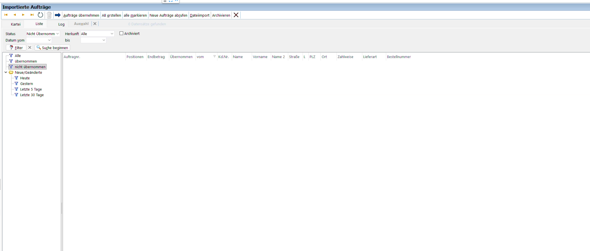
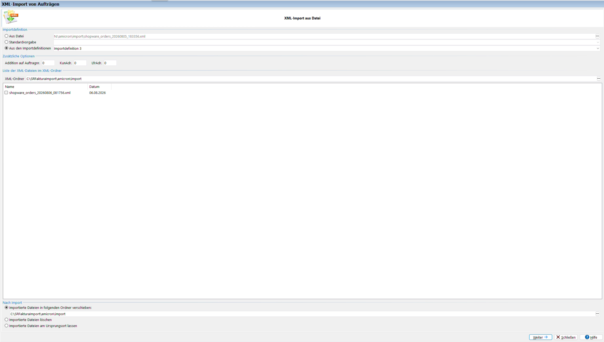

# Shopware → Amicron Faktura Bestellimport

[Änderungsprotokoll](#änderungsprotokoll)

Ersetzt das alte, mit Shopware 5/älter mitgelieferte Amicron-Script
`af13_shopware.php` (lief im `engine`-Ordner des alten Shops), das mit
Shopware 6 nicht mehr funktioniert. Dieses Tool holt offene Bestellungen
per Shopware-6-Admin-API und übergibt sie Amicron Faktura 13 Pro über den
ganz normalen Datei-Import (`Extras > Datenimport > Aufträge (Datei)`),
mit der bereits vorhandenen **Importdefinition 3**.

## Überblick

```
Shopware 6.7 Admin-API  --->  import_orders.py  --->  XML-Datei  --->  Faktura-Datei-Import (Importdefinition 3)
```

1. `import_orders.py` meldet sich per OAuth2 (Client-Credentials) an der
   Shopware-Admin-API an.
2. Es lädt alle Bestellungen mit Bestellstatus **"offen"**
   (`stateMachineState.technicalName = open`).
3. Für jede Bestellung wird ein `<ORDER>`-Block im Amicron-XML-Format
   erzeugt (Adresse, Artikel, Zahlart, Versandkosten, Verkaufskanal, ...).
4. Die XML-Datei wird in einen lokalen Ordner geschrieben, den Faktura
   überwacht.
5. In Faktura wird die Datei manuell (oder per Scheduler) über den
   XML-Import-Dialog eingelesen.

Das Script läuft **lokal auf dem PC, auf dem auch Faktura bedient wird**
(nicht auf einem Server) — nur so kann Faktura den erzeugten Ordner ohne
Netzwerk-/Berechtigungsprobleme im Datei-Auswahldialog sehen.

## 1. Einrichtung in Shopware 6

1. Admin-Bereich öffnen: **Einstellungen → System → Integrationen**
2. **"Integration anlegen"** klicken, Namen vergeben (z. B.
   `AmicronFakturaImport`)
3. Rechte vergeben: entweder **Administratorrechte** aktivieren (einfach,
   für ein internes Tool vertretbar), oder eine eigene Rolle mit
   Lesezugriff auf **Bestellungen** und **Kunden** anlegen und der
   Integration zuweisen (sauberer, aber aufwändiger einzurichten)
4. Die angezeigte **Access-ID** und den **Secret-Key** sofort notieren —
   der Secret-Key wird danach nicht mehr angezeigt
5. Diese beiden Werte werden später in `config.ini` als `client_id` /
   `client_secret` eingetragen

Es wird keine Änderung an der Shopware-Installation selbst benötigt
(kein Plugin, kein Custom-Script) — nur diese eine Integration.

## 2. Einrichtung in Faktura

Die Feldzuordnung ("Importdefinition 3") existiert in dieser Installation
bereits und wird **nicht** verändert — das Script erzeugt XML, das exakt
zu dieser Definition passt (Tags wie `id`, `number`, `billing`/`shipping`,
`details/item/articleNumber`, `payment/description`, `dispatch/name`,
Kodierung `iso-8859-1`).

**Bei einer neuen/anderen Faktura-Installation**, in der diese
Importdefinition noch nicht existiert: Die mitgelieferte
`Faktura_Importdefinition.xml` unter *Einstellungen → Importdefinitionen*
als neue Definition laden. Das Mapping (z. B. welches Feld in welches
Freifeld geschrieben wird) ist von Amicron für die eigene Faktura-Version
vorgesehen und muss ggf. je nach individuellem Faktura-Setup angepasst
werden.

Einzustellen ist nur, **woher** Faktura die Dateien liest:

1. Menü **Extras → Datenimport → Aufträge (Datei)**
2. Bei **Importdefinition**: Option **"Aus den Importdefinitionen"**
   wählen, dort **"Importdefinition 3"**
3. Bei **XML-Ordner**: `C:\SRFakturaImport\amicron\import` (der lokale
   Ordner, in den das Script schreibt, siehe Abschnitt "Ordnerstruktur")
4. Bei **"Nach Import"**: aktuell produktiv auf **"Importierte Dateien in
   folgenden Ordner verschieben"** mit demselben Pfad eingestellt (siehe
   Screenshot unten). Empfehlenswert wäre stattdessen ein separater
   `\erledigt`-Unterordner (`C:\SRFakturaImport\amicron\import\erledigt`),
   damit importierte und neue Dateien nicht im selben Ordner landen — das
   Setup-Script legt diesen Unterordner bereits vorsorglich an, er muss
   in Faktura nur noch ausgewählt werden





## 3. Installation des Tools (was die `.bat`-Datei macht)

Voraussetzung: die ZIP-Datei wurde irgendwo auf dem Ziel-PC entpackt
(Downloads-Ordner reicht völlig aus) — von dort übernimmt das Setup den
Rest automatisch.

Doppelklick auf **`SRFakturaImport_Setup.bat`** startet
`SRFakturaImport_Setup.ps1` und führt automatisch aus:

0. **Vorhandene Installation erkennen und Programmdateien an den festen
   Zielort kopieren** — falls am Zielort (`C:\SRFakturaImport\scripts\shopware-amicron-import\`)
   bereits eine `VERSION`-Datei existiert, zeigt das Script die installierte
   Version an und fragt: *"Möchten Sie die neue Version installieren? (j/n)"*
   mit dem Hinweis, dass alte Programmdateien überschrieben werden. Bei "n"
   bricht das Setup ab, ohne etwas zu verändern. Bei "j" (oder bei einer
   Erstinstallation) werden alle Dateien an den festen Zielort kopiert —
   **außer einer bereits vorhandenen `config.ini`**, die nie überschrieben
   wird, damit manuell eingetragene Zugangsdaten erhalten bleiben.
1. **Python prüfen/installieren** — falls `python` nicht gefunden wird,
   Installation über `winget install --id Python.Python.3.12`; falls
   winget nicht verfügbar ist, Fallback auf Direkt-Download des
   offiziellen Installers von python.org. Der PATH wird danach in der
   laufenden Sitzung aus der Registry neu geladen, ein Neustart der
   Konsole ist nicht nötig.
2. **Bibliothek installieren** — `pip install requests`
3. **Ordnerstruktur anlegen** — `C:\SRFakturaImport\amicron\import\erledigt`
   (fester Pfad, unabhängig vom Programmordner)
4. **`config.ini` vorbereiten** — falls noch keine vorhanden ist, wird
   sie aus `config.ini.example` erzeugt, wobei der `import_folder`-Pfad
   automatisch korrekt (absolut) eingetragen wird. `shop_url`,
   `client_id`, `client_secret` müssen danach von Hand ergänzt werden.
5. **Desktop-Verknüpfung anlegen/aktualisieren** — `Shopware Bestellimport (vX.Y.Z).lnk`
   mit `import_orders.ico` als Icon, Ziel ist `import_orders.py` am
   festen Zielort. Die Versionsnummer kommt aus der `VERSION`-Datei und
   steht damit direkt als Text unter dem Desktop-Icon — so ist auf einen
   Blick erkennbar, ob die aktuelle Version installiert ist. Eine bereits
   vorhandene ältere/anders benannte Verknüpfung wird entfernt und neu
   angelegt. **Hinweis:** Windows lässt sich dabei nicht zuverlässig dazu
   bringen, die bisherige Desktop-Position beizubehalten (auch nicht über
   gezielte Shell-Benachrichtigungen) — nach einem Update daher ggf. das
   Icon per Hand an die gewünschte Stelle ziehen.
6. **Änderungsprotokoll öffnen** — bei einer Erstinstallation oder wenn
   tatsächlich eine andere Version installiert wird, öffnet sich ein
   Browser-Tab mit dem [Änderungsprotokoll](#änderungsprotokoll) dieses
   READMEs auf GitHub — allerdings erst, **nachdem das Konsolenfenster
   geschlossen wurde** (ein Hintergrundprozess wartet darauf), nicht
   während der Nutzer die Setup-Ausgabe noch liest. Bei einem erneuten
   Lauf ohne Versionswechsel passiert das nicht.
7. **Aufräum-Hinweis** — falls Schritt 0 tatsächlich kopiert hat, zeigt
   das Script am Ende einen Hinweis, dass die ursprüngliche ZIP-Datei und
   der Entpack-Ordner nach dem Schließen dieses Fensters manuell gelöscht
   werden können (kein automatisches Löschen mehr).

Eine Neuinstallation (neuer PC, frisches Windows) bedeutet danach nur
noch: ZIP irgendwo entpacken, `.bat` doppelklicken, `config.ini` mit den
drei Shopware-Werten befüllen — fertig. Ein **Update** auf eine neue
Version läuft genauso: neue ZIP entpacken und `.bat` ausführen —
Programmdateien werden am Zielort überschrieben, die Desktop-Verknüpfung
automatisch mit der neuen Versionsnummer neu angelegt (Position ggf. per
Hand nachziehen).

## 4. Ordnerstruktur

Der Script-/Programmordner und der Import-Ordner sind zwei getrennte,
feste Pfade:

```
C:\SRFakturaImport\scripts\shopware-amicron-import\   (Programmordner, Ort beliebig waehlbar)
├── import_orders.py
├── import_orders.ico
├── config.ini                  (enthält Zugangsdaten, nicht versionieren!)
├── config.ini.example
├── Faktura_Importdefinition.xml
├── VERSION
├── SRFakturaImport_Setup.ps1
├── SRFakturaImport_Setup.bat
└── README.md

C:\SRFakturaImport\amicron\import\    (fester Pfad, in Faktura als XML-Ordner hinterlegt)
├── shopware_orders_*.xml       (vom Script erzeugte Dateien)
└── erledigt\                   (optionaler Zielordner fuer "Nach Import verschieben")
```

`import_folder` in `config.ini` muss exakt auf `C:\SRFakturaImport\amicron\import`
zeigen — dieser Pfad ist unabhängig davon, wo der Programmordner selbst liegt.

## 5. `config.ini` — Felder erklärt

```ini
[shopware]
shop_url = https://www.deinshop.de     ; Shop-URL ohne abschliessenden Slash
client_id = ...                        ; Access-ID der Shopware-Integration
client_secret = ...                    ; Secret-Key der Shopware-Integration
order_state = open                     ; Technischer Name des zu exportierenden Bestellstatus

[faktura]
import_folder = C:\...\import          ; Ordner, den Faktura ueberwacht (absoluter Pfad!)
file_prefix = shopware_orders          ; Dateiname-Praefix, Zeitstempel wird automatisch angehaengt
```

## 6. Individuelle Anpassungen (Stephan-spezifisch)

Diese Regeln sind fest im Script (`import_orders.py`) hinterlegt und für
diesen Anwendungsfall angepasst — bei Wiederverwendung für einen anderen
Shop ggf. überprüfen/ändern:

- **Bestellnummer-Feld**: enthält `Bestellnummer - Verkaufskanal`
  (z. B. `100551 - Sicherungsstangen.de`), da über einen Shop zwei
  Verkaufskanäle (Sicherungsstangen.de, Mörtelspritzen.de) laufen
- **Artikelname**: bei Varianten-Produkten (z. B. Sicherungsstangen mit
  Auswahl von Größe/Farbe) werden die vom Kunden gewählten Optionen aus
  `payload.options` an den Artikelnamen angehängt, z. B.
  `ADE Sicherungsstange (Größe: für Laibungsbreite 39-51 cm, Farbe: Weiß - ähnlich RAL 9016 Verkehrsweiß)`
  — sonst würde in Faktura nur die reine Produktbezeichnung ohne die
  Kundenauswahl ankommen. Die Optionsgruppe **"Lieferung nach"** wird
  dabei bewusst ausgeschlossen (steht in `OPTION_GROUPS_EXCLUDED_FROM_ARTICLE_NAME`
  in `import_orders.py`), da sie nur die Versandländer-Auswahl ist, kein
  Produktmerkmal
- **Länderkürzel ("L"-Feld)**: Shopware liefert 2-stellige ISO-Codes
  (`DE`, `AT`, ...), die unverändert übertragen werden. Das passt exakt
  zur "Landeskürzel"-Spalte in Faktura's Länder-Stammdaten
  (*Einstellungen → Länderauswahl*), wo z. B. Österreich als `AT`
  geführt wird — die `CONVERTLAND`-Tabelle in der alten
  Shopware-V4.1-Importdefinition (mit Kurzcodes wie `A`/`D`) ist dafür
  nicht (mehr) maßgeblich.
- **Lieferart**: wird immer fest als `Paketdienst` übertragen, unabhängig
  von der in Shopware hinterlegten Versandart
- **Bestelldatum**: Format `TT.MM.JJJJ` (deutsches Datumsformat)
- **Versandkosten-Artikel**: Line-Items mit "Versandkosten" im Namen
  bekommen automatisch die feste Faktura-Artikelnummer `1000154`
  zugewiesen, unabhängig von der Shopware-Artikelnummer
- **E-Mail-Adresse**: wird innerhalb des `billing`/`KUNADRESSE`-Blocks
  übertragen (nicht als eigenständiges Tag) — das war nötig, damit
  Faktura die Adresse korrekt dem neu angelegten Kundendatensatz
  zuordnet (siehe Troubleshooting)

## Troubleshooting / bekannte Stolperfallen

- **`Accept: application/json` fehlt** → Shopware liefert Bestelldaten
  sonst im JSON:API-Format (verschachtelt unter `attributes`), das
  Script erwartet aber das flache Format. Ohne diesen Header sind alle
  Felder leer.
- **Backslash nach Laufwerksbuchstabe** → `import_folder = c:Pfad\...`
  (ohne `\` direkt nach dem Doppelpunkt) ist unter Windows KEIN
  absoluter Pfad, sondern "relativ zum aktuellen Verzeichnis auf
  Laufwerk C:". Führt zu falsch platzierten Dateien ohne Fehlermeldung.
  Immer `C:\Pfad\...` mit Backslash direkt nach dem Doppelpunkt
  verwenden.
- **winget-Paket-ID Groß-/Kleinschreibung** → die korrekte ID ist
  `Python.Python.3.12` (großes P in der Mitte), nicht `Python.python.3.12`.
- **Desktop-Icon-Position geht bei einem Update verloren** → ausprobiert
  wurden sowohl ein einfaches Löschen+Neuanlegen der Verknüpfung als auch
  ein Umbenennen an Ort und Stelle mit gezielter Shell-Benachrichtigung
  (`SHCNE_RENAMEITEM`) — beides hat die Windows-interne Positions-
  Zuordnung nicht zuverlässig beibehalten (auch unabhängig von den
  Ansicht-Einstellungen "Automatisch anordnen"/"Am Raster ausrichten").
  Das Icon einfach nach einem Update per Hand an die gewünschte Stelle
  ziehen.
- **Netzlaufwerke in Faktura nicht sichtbar** → falls Faktura auf einem
  Server läuft und über RDP bedient wird: gemappte Netzlaufwerke sind
  nur in der Windows-Sitzung sichtbar, in der sie erstellt wurden;
  UAC-Elevation (z. B. "Als Administrator ausführen") kann das Laufwerk
  "verstecken". Betrifft diese Installation nicht mehr, da das Script
  jetzt lokal auf dem Faktura-PC läuft, ist aber relevant, falls das
  Tool auf einem Server-Setup wiederverwendet wird.
- **E-Mail-Adresse zeigt Shop-Domain statt Kunden-E-Mail** → trat auf,
  solange `<email>` als eigenständiges Tag außerhalb des
  `<billing NewData="KUNADRESSE">`-Blocks stand. Fix: `<email>` wurde in
  den `billing`-Block verschoben (bestätigt durch Vergleich mit der für
  HaBeFa.de funktionierenden Importdefinition, die `EMAIL` ebenfalls
  innerhalb der `CUSTOMERS_ADDRESS`/`KUNADRESSE`-Gruppe verschachtelt).

## Änderungsprotokoll

### 1.9.1 (2026-08-06)
- Desktop-Refresh nach dem Setup wieder auf den ursprünglichen, bewährten
  Befehl (`SHCNE_ASSOCCHANGED`) umgestellt — die gezieltere Variante
  (`SHCNE_UPDATEDIR`) aus 1.8.x hat gelöschte alte Verknüpfungen nicht
  zuverlässig sofort ausgeblendet (manuelles F5 war noch nötig)

### 1.9.0 (2026-08-06)
- Automatisches Erhalten der Desktop-Icon-Position beim Update wieder
  entfernt — funktionierte trotz mehrerer Ansätze nicht zuverlässig.
  Verknüpfung wird jetzt einfach entfernt und neu angelegt; Position bei
  Bedarf per Hand nachziehen
- Automatisches Löschen von ZIP-Datei und Entpack-Ordner (Papierkorb)
  entfernt — stattdessen zeigt das Setup am Ende nur noch einen Hinweis,
  dass beides nach dem Schließen des Fensters manuell gelöscht werden kann

### 1.8.1 (2026-08-06)
- Papierkorb-Aufräumen wartet jetzt (genau wie das Öffnen des
  Änderungsprotokolls) darauf, dass das Konsolenfenster wirklich
  geschlossen ist, bevor der Entpack-Ordner gelöscht wird — eine reine
  2-Sekunden-Verzögerung reichte nicht, da `cmd.exe` diesen Ordner bis
  zum Tastendruck bei "Drücke eine beliebige Taste" als Arbeitsverzeichnis
  hält und Windows das Löschen so lange verweigert

### 1.8.0 (2026-08-06)
- Papierkorb-Aufräumen (ZIP + Entpack-Ordner) läuft jetzt zuverlässig in
  einem echten Hilfsscript statt einer fragilen Inline-Befehlszeile, und
  die ZIP-Suche verwendet keine `-Filter`-Wildcards mehr (gleiche
  Unzuverlässigkeit wie bei der Verknüpfungssuche)
- Desktop-Icon-Position bleibt beim Update jetzt wirklich erhalten: statt
  eines kompletten Desktop-Refresh (`SHCNE_ASSOCCHANGED`, der die
  Anordnung durcheinanderbringen konnte) wird Windows gezielt nur über
  die eine umbenannte Verknüpfung informiert (`SHCNE_RENAMEITEM`)
- Änderungsprotokoll öffnet sich im Browser erst, nachdem das
  Konsolenfenster geschlossen wurde, nicht mehr während des Setups

### 1.7.0 (2026-08-06)
- Setup öffnet bei Erstinstallation oder Versionswechsel automatisch das
  Änderungsprotokoll dieses READMEs im Browser
- `LICENSE` (MIT) und "Bugs melden"-Abschnitt (Link zu GitHub Issues)
  ergänzt

### 1.6.0 (2026-08-06)
- Beim Update wird die alte Desktop-Verknüpfung jetzt umbenannt statt
  gelöscht und neu angelegt — dadurch behält das Icon seine bisherige
  Position auf dem Desktop, statt an eine neue Stelle zu springen

### 1.5.2 (2026-08-06)
- Desktop wird nach dem Setup automatisch neu gezeichnet (`SHChangeNotify`),
  damit gelöschte alte Verknüpfungen sofort verschwinden, ohne dass
  manuell F5 gedrückt werden muss

### 1.5.1 (2026-08-06)
- Papierkorb-Aufräumschritt behoben: Löschen des eigenen (noch laufenden)
  Entpack-Ordners scheiterte mit "Datei wird von einem anderen Prozess
  verwendet" — läuft jetzt verzögert in einem Hintergrundprozess, der erst
  nach Beendigung des Setup-Scripts startet

### 1.5.0 (2026-08-06)
- Setup erkennt eine bereits vorhandene Installation (anhand der
  `VERSION`-Datei am Zielort), zeigt die installierte Version an und
  fragt vor dem Überschreiben um Bestätigung (j/n)
- Eine bereits vorhandene `config.ini` am Zielort wird beim Update nie
  überschrieben — manuell eingetragene Zugangsdaten bleiben erhalten

### 1.4.0 (2026-08-06)
- Setup kopiert sich jetzt selbst an einen festen, dauerhaften Zielort
  (`C:\SRFakturaImport\scripts\shopware-amicron-import`), egal von wo
  aus es gestartet wird (z. B. direkt aus einem in Downloads entpackten
  ZIP-Ordner)
- Am Ende des Setups optionale Abfrage: ursprüngliche ZIP-Datei und
  Entpack-Ordner in den Papierkorb verschieben, sodass nur noch das
  fertig installierte Tool übrig bleibt

### 1.3.0 (2026-08-06)
- Zentrale `VERSION`-Datei als Versionsquelle eingeführt
- Desktop-Verknüpfung enthält jetzt die Versionsnummer im Dateinamen
  (`Shopware Bestellimport (vX.Y.Z).lnk`), damit sie direkt unter dem
  Icon sichtbar ist
- Setup-Script entfernt beim erneuten Ausführen automatisch ältere/
  anders benannte Verknüpfungen, um Duplikate zu vermeiden

### 1.2.1 (2026-08-06)
- Länderkürzel-Fix aus 1.1.0 korrigiert: Es wird wieder der reine,
  unveränderte 2-stellige ISO-Code (`DE`, `AT`, ...) übertragen — das
  entspricht Faktura's tatsächlicher Länder-Stammdatentabelle, die
  vorherige Umschreibung auf `AUT` war ein Irrtum

### 1.2.0 (2026-08-06)
- Konsolenfenster schließt sich nach dem Lauf nicht mehr automatisch
  (auch bei Fehlern) — es bleibt offen mit einer Meldung, bis manuell
  mit Enter geschlossen wird
- Klarere Meldung bei keinen offenen Bestellungen: "Es sind keine neuen
  Bestellungen eingegangen!"

### 1.1.0 (2026-08-06)
- Artikelname enthält jetzt die vom Kunden gewählten Varianten-Optionen
  (z. B. Größe, Farbe), nicht mehr nur die reine Produktbezeichnung
  (Option "Lieferung nach" bewusst ausgeschlossen)
- Länderkürzel wird als 3-stelliger ISO-Code (`DEU`/`AUT`) übertragen,
  damit Faktura's `CONVERTLAND`-Tabelle auch Österreich korrekt erkennt

### 1.0.0 (2026-08-06)
- Erste vollständige, produktiv getestete Version
- OAuth2-Anbindung an Shopware-6.7-Admin-API, Export offener Bestellungen
- XML-Erzeugung passend zur bestehenden Amicron-Importdefinition 3
- Verkaufskanal wird in die Bestellnummer eingetragen
- Lieferart fest auf "Paketdienst", Datumsformat TT.MM.JJJJ
- Versandkosten-Artikel wird auf feste Faktura-Artikelnummer 1000154 gemappt
- E-Mail-Zuordnungsfehler behoben (Tag in `billing`-Block verschoben)
- Automatisiertes Setup per `SRFakturaImport_Setup.bat`
  (Python-Installation, Ordnerstruktur, `config.ini`, Desktop-Icon)

## Bugs melden

Fehler oder Ideen für nächste Schritte bitte unter
[github.com/Stephan-Lefty/shopware-amicron-import/issues](https://github.com/Stephan-Lefty/shopware-amicron-import/issues)
eintragen.

## Lizenz

MIT, siehe [LICENSE](LICENSE).
